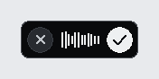
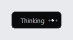
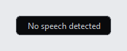
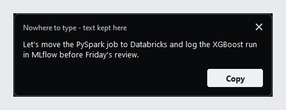

# Typeless Nano

*[English](README.md) | 繁體中文*

Windows 上的離線英文語音輸入工具。按一下 **Right Alt**，說話，再按一下 **Right Alt**，
文字就會輸入到你原本所在的視窗。語音辨識完全在本機以 Whisper 或 Qwen3-ASR 執行，
不會傳送任何資料，也不會在硬碟上保存任何內容。

<p align="center">
  
</p>

## 功能

- **一個鍵，切換錄音。** Right Alt 開始、再按停止。其他所有按鍵（包括 F1 和 Left Alt）
  都原封不動地傳遞。
- **輸入到原本的視窗。** 文字會送到開始錄音時位於前景的視窗。如果期間切換了視窗，
  就不會輸入到錯誤的地方。
- **不會弄丟你說的話。** 文字無法輸入時，會留在一個附 `Copy` 按鈕的小面板中，
  直到你處理為止。
- **即時波形。** 錄音膠囊顯示麥克風的真實音量，由右向左捲動，一眼就能確認麥克風
  有收到你的聲音。
- **完全離線。** 模型只從本機資料夾載入，執行期間不會發出任何網路請求。
- **輕量。** 只有四個直接依賴、一個 Python 程序，不需要安裝程式。

## 畫面說明

| 狀態 | 外觀 | 意思 |
|---|---|---|
| 錄音中 |  | 請說話，波形會跟著你的聲音變化。`×` 取消，`✓` 完成。 |
| 轉錄中 |  | 正在轉錄，完成後立即輸入文字。 |
| 沒有語音 |  | 錄音是靜音或太短，提示會自動消失。 |
| 無處輸入 |  | 目標視窗已關閉或已切換。`Copy` 會把文字複製到剪貼簿。 |

這些視窗都不會搶走焦點，你正在輸入的程式會保持在前景。狀態切換時會有簡短的提示音：
開始時是上升的雙音，停止時是同一組下降的雙音，取消時是單一低音。

## 快速開始

需要 Windows 和 Python 3.12。

**1. 安裝**

```powershell
python -m venv .venv
.venv\Scripts\activate
pip install -r requirements.txt
```

**2. 取得模型**（唯一需要連網的步驟）

```powershell
hf download openai/whisper-small.en --local-dir models\whisper-small.en
```

那台電腦無法連到 Hub？請從 <https://huggingface.co/openai/whisper-small.en/tree/main>
手動下載檔案到 `models\whisper-small.en`。需要以下檔案；`.gitattributes` 和
`.msgpack` / `.h5` / `.ot` 權重檔可以略過：

```text
config.json  generation_config.json  merges.txt  model.safetensors
normalizer.json  preprocessor_config.json  special_tokens_map.json
tokenizer.json  tokenizer_config.json  vocab.json  added_tokens.json
```

**3. 執行**（在專案資料夾內執行，模型路徑是相對於它的）

```powershell
python app.py
```

等到出現 `Typeless Nano is ready.`，點進任何文字輸入框，按 Right Alt。

改用 Conda：

```powershell
conda create -n typeless_nano python=3.12 pip -y
conda run -n typeless_nano python -m pip install -r requirements.txt
conda run --no-capture-output -n typeless_nano python app.py
```

請保留 `--no-capture-output`，否則 Conda 會暫存 console 輸出，程式看起來像當掉了。

## 使用方式

1. 把游標放在要輸入文字的位置。
2. 按 **Right Alt**，說英文。
3. 再按一次 **Right Alt**，或點 `✓`。
4. 在文字出現之前，停留在同一個視窗。

點 `×` 可捨棄這次錄音。錄音超過 60 秒會自動停止，並照常轉錄。在 console 按
`Ctrl+C` 結束程式。

## 選項

| 選項 | 作用 |
|---|---|
| `--model auto\|qwen\|whisper` | 選擇模型。`auto`（預設）優先使用 Qwen；Qwen 不存在或載入失敗時改用 Whisper。 |
| `--model-path PATH` | 從其他資料夾載入所選的模型。 |
| `--device auto\|cpu\|cuda` | 模型執行的裝置。CUDA 記憶體不足時會退回 CPU。 |
| `--microphone NAME_OR_INDEX` | 指定麥克風，參見 `--list-microphones`。 |
| `--list-microphones` | 列出輸入裝置後結束。 |
| `--mute-cues` | 關閉開始／停止提示音。 |
| `--no-clipboard-fallback` | 輸入失敗時，不把文字複製到剪貼簿。 |
| `--new-paragraph` | 把說出的「new paragraph」轉成換行。 |
| `--verify-checksums` | 載入前以固定的 SHA-256 雜湊檢查模型檔案。 |

## 模型

程式永遠不會下載模型。請把核准的 checkpoint 放在這裡：

```text
models/
  qwen3-asr-0.6b-hf/
    config.json
    model.safetensors
    ...
  whisper-small.en/
    config.json
    model.safetensors
    ...
```

或指向任何本機資料夾：

```powershell
python app.py --model whisper --model-path D:\ApprovedModels\whisper-small.en
```

先固定一次 checksum，之後每次啟動都驗證：

```powershell
python scripts/model_sha256.py D:\ApprovedModels\whisper-small.en --write
python app.py --model whisper --model-path D:\ApprovedModels\whisper-small.en --verify-checksums
```

## 隱私

- 以 `HF_HUB_OFFLINE=1` 和 `TRANSFORMERS_OFFLINE=1` 執行；所有模型載入都使用
  `local_files_only=True`。
- 音訊只存在記憶體中，音訊和轉錄文字都不會寫入硬碟。
- 日誌只記錄狀態名稱、延遲和錯誤代碼，絕不記錄你說了什麼。
- 轉錄完成後會重新檢查前景視窗，只有仍是開始錄音時的那個視窗才會輸入文字。

## 疑難排解

| 症狀 | 解決方式 |
|---|---|
| 用 Conda 執行時 console 一片空白 | 在 `conda run` 加上 `--no-capture-output`。 |
| `can't open file ... app.py` | 要在專案資料夾內執行，不是在使用者主資料夾。 |
| 說話時波形一直是平的 | 麥克風選錯或被靜音。執行 `--list-microphones`，再用 `--microphone` 指定。 |
| 安靜時波形仍在跳動 | 環境吵雜或麥克風增益太高。調高 `dictation/config.py` 裡的 `meter_floor_db`。 |
| 某個程式永遠收不到文字 | 以系統管理員權限執行的程式會拒絕一般程式的輸入。讓兩者以相同權限執行。 |
| 第一次聽寫很慢 | 模型正在 CPU 上載入或暖機，之後會變快；有 CUDA GPU 幫助最大。 |

## 開發

測試需要 Windows，但不需要模型：

```powershell
python -m unittest discover -s tests -v
python scripts/dependency_gate.py
```

`requirements.txt` 只列出公司核准的四個直接依賴（`sounddevice`、`pywin32`、`torch`、
`transformers`）；`dependency_gate.py` 會檢查它們的確切版本，並列出間接依賴。
NumPy 在程式中直接使用，但它是以間接依賴的方式安裝的。

用 Windows SAPI 語音產生的語音做端到端檢查。暫存的 WAV 事後會刪除，輸出只有延遲和
字數：

```powershell
python -m scripts.smoke_transcription --model whisper
```

在新電腦上正式使用前的手動檢查：

1. `dependency_gate.py` 回報四個直接依賴都是確切版本。
2. `--list-microphones` 列出預期的裝置。
3. 在記事本中，Right Alt 能開始與停止錄音，並播放上升與下降提示音。
4. 靜音或短於 250 ms 的錄音會記錄 `utterance_rejected`，並顯示「No speech detected」。
5. 停止錄音後立刻切換視窗，會記錄
   `injection_skipped reason=foreground_window_changed` 並顯示救援面板。
6. 超過 60 秒的錄音會被 watchdog 停止。
7. 在 Outlook、Teams、Chrome 和 VS Code 各聽寫幾次。

## 平台

僅支援 Windows。熱鍵（Win32 low-level keyboard hook）、文字輸入（`SendInput`）、
不搶焦點的浮窗和提示音（`winsound`）都直接使用 Windows API。
